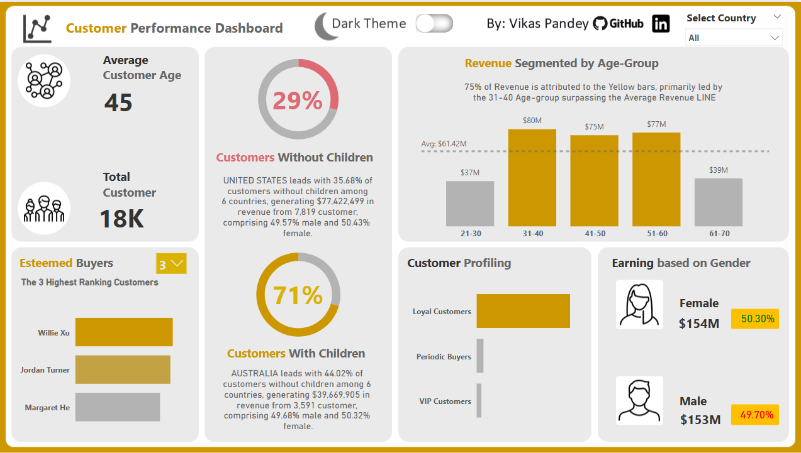

# 📊 Customer Performance Dashboard

## Power BI Project Documentation

---

### 🔹 Overview

The Customer Performance Dashboard is an interactive data visualization solution developed using Power BI. It provides deep insights into customer behavior, demographics, purchasing trends, and revenue contributions. This project empowers business stakeholders to make data-informed decisions through intuitive storytelling and actionable metrics.

By integrating multiple data sources, applying data transformation techniques, and creating advanced DAX measures, this dashboard facilitates strategic customer profiling and segmentation—enabling organizations to improve targeting, enhance customer satisfaction, and drive sales growth.

---

---

### 🔹 Project Objectives

- Understand customer demographics and behavior patterns.  
- Identify revenue-driving customer segments (e.g., age, gender, children status).  
- Build a dynamic, filterable dashboard for stakeholder use.  
- Classify customers by loyalty, spending, and purchasing patterns.  
- Enable informed marketing and operational strategies to improve ROI.  

---

### 🔹 Data Sources & Schema

The dashboard is built on a star schema model with one fact table and multiple dimension tables:

| Table Name       | Description                                                                       |
|------------------|-----------------------------------------------------------------------------------|
| FactTable        | Transaction-level sales data including quantity, revenue, and product references. |
| DimProduct       | Product attributes like name, category, color, price, and cost.                   |
| DimCustomer      | Customer demographics: age, gender, marital status, children, and income.         |
| DimSalesTerritory| Sales region details enabling territory-wise performance tracking.                |
| DimGeography     | Location-based attributes (city, country, state).                                 |
| DimDate          | Calendar information used to analyze time-based trends.                           |

---

### 🔹 Key Features

- ✅ Interactive Filters & Drilldowns – Easily toggle by age, gender, geography, and customer types.  
- ✅ Customer Segmentation – Profiles customers into VIP, Loyal, and Periodic Buyers.  
- ✅ Dynamic Ranking – Real-time listing of top revenue-generating customers.  
- ✅ Revenue Analysis – Revenue breakdowns by demographics and location.  
- ✅ Custom Metrics & Conditional Formatting – Highlights performance gaps visually using color cues.  

---

### 🔹 Methodology & Steps

The Power BI development process followed the below stages:

#### 🔁 Data Preparation
- Imported necessary columns from each table.  
- Removed null values and irrelevant fields.  
- Created data relationships (Power BI auto-detected most links via primary/foreign keys).  

#### 🧮 DAX Measures & Calculated Columns
- Created reusable measure tables (`AllMeasures`, `CustomerMeasures`) for modular analytics.  
- Calculated:  
  - `Total Revenue`  
  - `Customer Age` & `Age Category`  
  - Revenue splits by age, gender, and children status  
  - Dynamic customer types (`VIP`, `Loyal`, `Periodic Buyers`)  
  - Gender-specific revenues & conditional formatting  
  - % contribution of top age groups or countries to overall revenue  

#### 🎨 Dashboard Design & UX
- Applied color-coded visual indicators for performance.  
- Designed slicers, dynamic visuals, and tooltips for enhanced interactivity.  
- Used bookmarks and dynamic parameters for top-N customer filtering.  

---

### 🔹 Business Questions Addressed

- What is the average age of our customers?  
- Which age group drives the highest revenue?  
- What percentage of customers have children?  
- How does gender affect purchasing behavior?  
- Who are our top customers based on total spending?  
- How do different countries contribute to our revenue?  

---

### 🔹 Key Insights & Outcomes

| Insight                    | Finding                                                                 |
|---------------------------|-------------------------------------------------------------------------|
| Average Customer Age      | 45 years                                                                |
| Total Unique Customers    | 18,000                                                                  |
| Customer Loyalty          | ~89% are Loyal Customers (2+ orders)                                   |
| Children vs. No Children  | 52% more revenue from customers with children                           |
| Top Age Segment           | Age 31–60 contributes highest revenue                                   |
| Gender Split              | ~50/50 male and female customers                                        |
| Top Performing Countries  | 🇺🇸 United States: 35.68% of customers without children, $77M revenue  |
|                           | 🇦🇺 Australia: 44.02% of customers without children, $62M revenue       |
| Average Revenue           | ~$62 million                                                            |
| High-value Customers      | Customers with ≥2 orders and ≥100 units purchased are VIPs              |

---

### 📈 Strategic Recommendations

1. **Target Age Groups 31–60 More Aggressively**  
   These age brackets generate the most revenue. Tailor marketing campaigns, bundles, and loyalty programs to this segment.

2. **Prioritize Families with Children**  
   Since customers with children outperform those without in revenue, develop family-oriented promotions and kid-centric product lines.

3. **Enhance VIP & Loyal Customer Engagement**  
   With 89% identified as loyal, implement referral programs, exclusive discounts, and early access to maintain this loyalty and convert Periodic Buyers.

4. **Geographic Focus**  
   Double down on top-performing countries (U.S., Australia) by exploring regional preferences and increasing inventory in high-demand zones.

5. **Balance Gender-based Offers**  
   With almost equal gender representation, ensure products and offers are inclusive and appeal equally to both demographics.

6. **Leverage Predictive Analytics**  
   Use historical behavior patterns to predict customer churn, personalize outreach, and forecast future revenue by demographic group.

---

### 🔧 Tools & Technologies

- **Power BI** – Data visualization and dashboard creation  
- **DAX (Data Analysis Expressions)** – Custom metrics and KPIs  
- **Power Query Editor** – Data cleaning and transformation  

---

### 📂 Dataset

**Source:** Customer Transaction Dataset  
[https://github.com/vikaspandey-001/Customer-Performance-Dashboard.git](https://github.com/vikaspandey-001/Customer-Performance-Dashboard.git)

---

### 🏁 Conclusion

The Customer Performance Dashboard is a robust analytical dashboard that transforms raw customer and sales data into strategic insights. It showcases the power of Power BI in solving real world business problems and demonstrates advanced DAX proficiency, customer segmentation logic, and storytelling via data. By implementing the recommendations drawn from this analysis, businesses can improve revenue generation, boost customer engagement, and refine marketing strategies.
